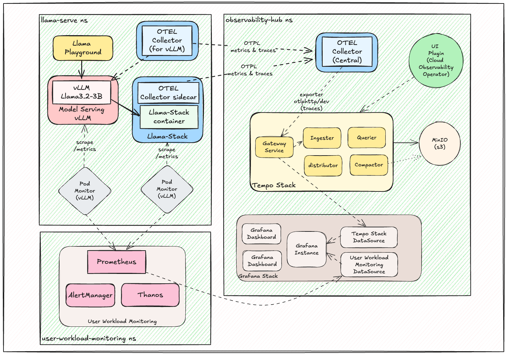
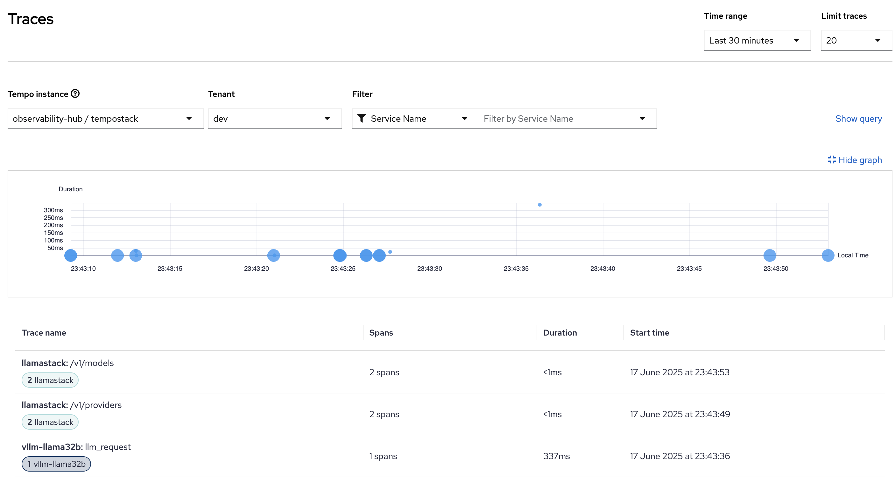
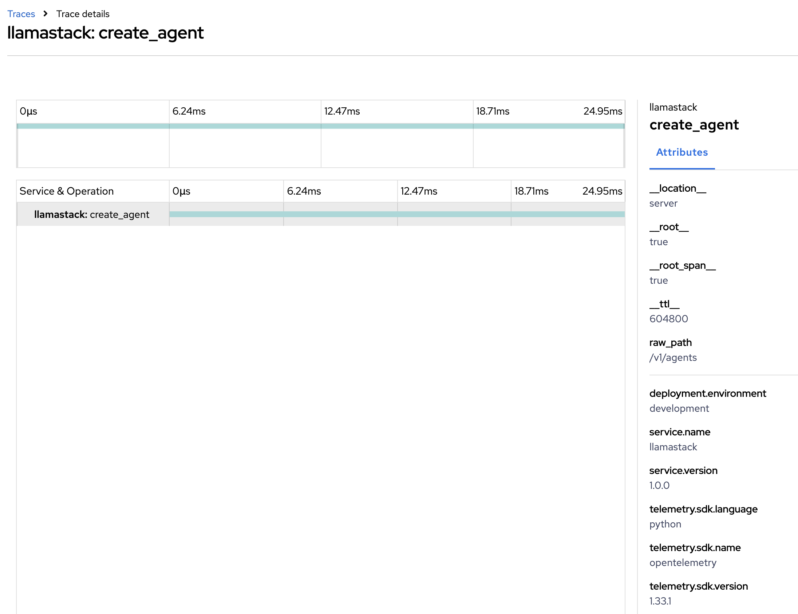

# Llama Stack Telemetry & Observability

Observability & telemetry kickstart for both Llama-Stack and OpenShift AI.

This repository provides helm charts for deploying AI services with telemetry and observability on Llama-Stack, OpenShift and OpenShift AI.

Jump straight to [installation](#installation) to get started quickly.

## Table of Contents

- [Detailed description](#detailed-description)
    - [Architecture](#architecture)
    - [Components](#components)
- [Requirements](#requirements)
- [Installation](#installation)
- [Advanced Usage](#advanced-usage)
- [References](#references)

## Detailed description

This telemetry and observability kickstart addresses the critical needs for Large Language Model (LLM) infrastructure. As AI workloads become more complex, organizations need:

- **AI observability** into model performance, resource utilization, and distributed tracing
- **Standardized deployment patterns** for consistent, scalable AI service delivery
- **Enterprise-grade monitoring** with OpenShift-native observability tools
- **Production-ready configurations** that follow cloud-native best practices

This repository provides helm charts for both the monitoring infrastructure and AI service deployments needed to run Llama Stack reliably in production environments.

### Architecture

The proposed observability & telemetry architecture:

.

### Components

All components are available as helm charts in the [`./helm/`](./helm/) directory:

#### Operators
- **[`cluster-observability-operator`](./helm/cluster-observability-operator/)** - PodMonitor/ServiceMonitor CRDs and UI plugins
- **[`grafana-operator`](./helm/grafana-operator/)** - Grafana operator for visualization and dashboard management
- **[`otel-operator`](./helm/otel-operator/)** - Red Hat Build of OpenTelemetry operator
- **[`tempo-operator`](./helm/tempo-operator/)** - Distributed tracing backend operator

#### Observability Components
- **[`otel-collector`](./helm/otel-collector/)** - OpenTelemetry collector configurations for telemetry collection and processing
- **[`tempo`](./helm/tempo/)** - Distributed tracing backend with S3-compatible storage
- **[`grafana`](./helm/grafana/)** - Visualization and dashboard management with pre-built dashboards
- **[`uwm`](./helm/uwm/)** - User Workload Monitoring with PodMonitors for VLLM and AI workloads
- **[`distributed-tracing-ui-plugin`](./helm/distributed-tracing-ui-plugin/)** - OpenShift console integration for tracing

#### AI Services
- **[`llama-stack`](./helm/llama-stack/)** - Complete Llama Stack deployment with configurable endpoints
- **[`llama3.2-3b`](./helm/llama3.2-3b/)** - Optimized Llama 3.2 3B model deployment on vLLM
- **[`llama-stack-playground`](./helm/llama-stack-playground/)** - Interactive Llama-Stack web interface for testing

#### MCP Servers
- **[`mcp-weather`](./helm/mcp-weather/)** - MCP weather service
- **[`hr-api`](./helm/hr-api/)** - MCP HR API demonstration service

### Observability in Action

The telemetry and observability stack provides comprehensive visibility into AI workload performance and distributed system behavior.

#### Distributed Tracing Examples



**End-to-End Request Tracing**: Complete visibility into AI inference request flows through the Llama Stack infrastructure.



**Create Agent from LlamaStack Tracing**: Detailed trace view showing complex interactions between different services in the AI stack.

These traces provide insights into:
- Request latency and service dependencies
- Error tracking and performance bottlenecks
- Load distribution across model endpoints

## Requirements

### Minimum Hardware Requirements

- **CPU**: 8+ cores recommended for full stack deployment
- **Memory**: 16GB+ RAM for monitoring stack, additional memory based on AI workload requirements
- **Storage**: 100GB+ for observability data retention
- **GPU**: NVIDIA GPU required for AI model inference (varies by model size)

### Required Software

- **OpenShift 4.12+** or **Kubernetes 1.24+**
- **OpenShift AI 2.19 onwards**
- **Helm 3.8+** for chart deployment
- **oc CLI** or **kubectl** for cluster management

### Required Operators

Install these operators from OperatorHub before deploying the observability stack:

Install manually from OperatorHub:
- Red Hat Build of OpenTelemetry Operator
- Tempo Operator
- Cluster Observability Operator
- Grafana Operator

### Required Permissions

- **Cluster Admin** - Required for operator installation and observability stack setup
- **GPU Access** - Required for AI workload deployment

## Installation

### Quick Start - Complete Stack

```bash
# 1. Create required namespaces
oc create namespace observability-hub
oc create namespace openshift-user-workload-monitoring

# 2. Install required operators
helm install cluster-observability-operator ./helm/cluster-observability-operator
helm install grafana-operator ./helm/grafana-operator
helm install otel-operator ./helm/otel-operator
helm install tempo-operator ./helm/tempo-operator

# 3. Wait for operators to be ready
oc wait --for=condition=Ready pod -l app.kubernetes.io/name=cluster-observability-operator -n openshift-cluster-observability-operator --timeout=300s
oc wait --for=condition=Ready pod -l app.kubernetes.io/name=observability-operator -n openshift-cluster-observability-operator --timeout=300s

# 4. Deploy observability infrastructure
helm install tempo ./helm/tempo -n observability-hub
helm install otel-collector ./helm/otel-collector -n observability-hub
helm install grafana ./helm/grafana -n observability-hub

# 5. Enable User Workload Monitoring for AI workloads
helm template uwm ./helm/uwm -n observability-hub | oc apply -f-

# Verify UWM setup
oc get configmap user-workload-monitoring-config -n openshift-user-workload-monitoring
oc get podmonitors -n observability-hub

# 6. Deploy AI workloads
helm install llama3-2-3b ./helm/llama3.2-3b \
  --set model.name="meta-llama/Llama-3.2-3B-Instruct" \
  --set resources.limits."nvidia\.com/gpu"=1

helm install mcp-weather ./helm/mcp-weather

helm install llama-stack ./helm/llama-stack \
  --set 'inference.endpoints[0].url=http://llama3-2-3b:80/v1' \
  --set 'mcpServers[0].name=weather' \
  --set 'mcpServers[0].uri=http://mcp-weather:80' \
  --set 'mcpServers[0].description=Weather MCP Server for real-time weather data'

helm install llama-stack-playground ./helm/llama-stack-playground \
  --set playground.llamaStackUrl="http://llama-stack:80"

# 7. Enable tracing UI
helm install distributed-tracing-ui-plugin ./helm/distributed-tracing-ui-plugin
```

## Advanced Usage

### Individual Component Deployment

#### Deploy Llama 3.2-3B on vLLM

```bash
helm install llama3-2-3b ./helm/llama3.2-3b \
  --set model.name="meta-llama/Llama-3.2-3B-Instruct" \
  --set resources.limits."nvidia\.com/gpu"=1 \
  --set nodeSelector."nvidia\.com/gpu\.present"="true"
```

#### Deploy MCP Weather Server

```bash
helm install mcp-weather ./helm/mcp-weather 
```

#### Deploy Llama Stack

```bash
helm install llama-stack ./helm/llama-stack \
  --set inference.endpoints[0].url="http://llama3-2-3b:80/v1" \
  --set mcpServers[0].name="weather" \
  --set mcpServers[0].uri="http://mcp-weather:80" \
  --set mcpServers[0].description="Weather MCP Server for real-time weather data"
```

#### Deploy the Playground

```bash
helm install llama-stack-playground ./helm/llama-stack-playground \
  --set playground.llamaStackUrl="http://llama-stack:80"
```

## References

### Documentation
- [OpenShift Distributed Tracing (Tempo)](https://docs.redhat.com/en/documentation/openshift_container_platform/4.18/html/distributed_tracing/distributed-tracing-platform-tempo)
- [OpenShift Observability](https://docs.redhat.com/en/documentation/openshift_container_platform/4.18/html/monitoring)
- [User Workload Monitoring](https://docs.redhat.com/en/documentation/openshift_container_platform/4.18/html/monitoring/enabling-monitoring-for-user-defined-projects)

### Related Projects
- [Llama Stack](https://github.com/meta-llama/llama-stack)
- [vLLM](https://github.com/vllm-project/vllm)
- [OpenTelemetry](https://opentelemetry.io/)
- [Grafana](https://grafana.com/)
- [Tempo](https://grafana.com/oss/tempo/)

### Community
- [Red Hat AI Kickstarts](https://github.com/rh-ai-kickstart)
- [OpenShift AI Documentation](https://docs.redhat.com/en/documentation/red_hat_openshift_ai_cloud_service)
